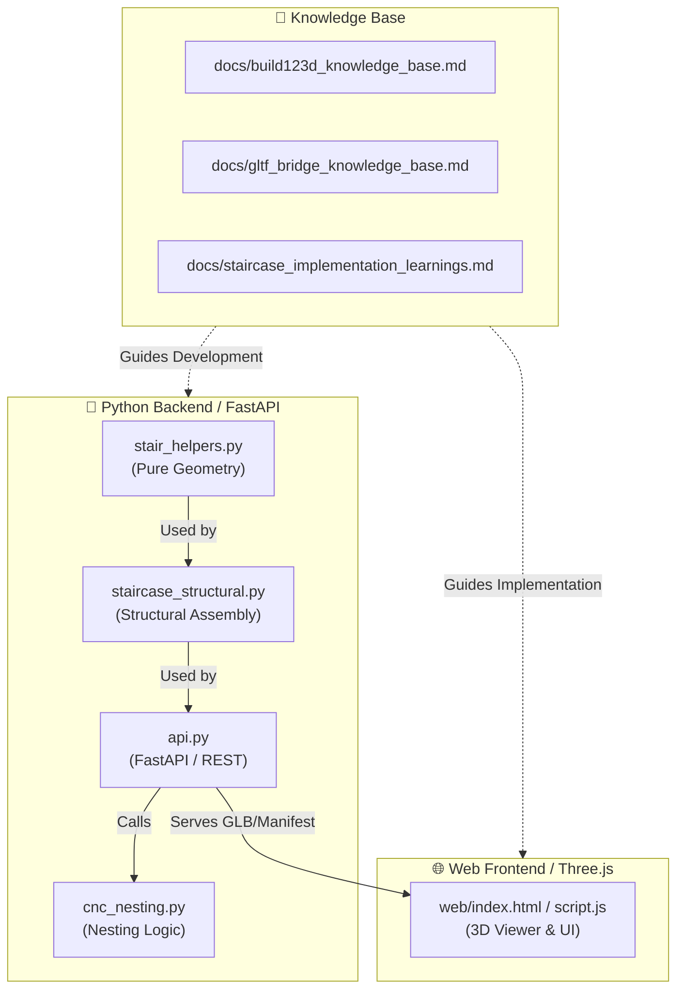

# Project Map & Architecture

## System Overview

This project has evolved from a collection of geometry scripts into a full-stack parametric CAD application. The architecture uses a Python backend for heavy geometric computation and a Three.js frontend for interactive visualization.

## File Categorization

### 🟢 Core Application
- **`stair_helpers.py`**: The "Geometry Engine". Contains the parametric `make_flight()`, `make_winder()`, and `unified_soffit` logic.
- **`staircase_structural.py`**: The "Structural Assembler". Decomposes the staircase into individual parts (treads, risers, stringers, etc.) and performs volumetric trimming.
- **`api.py`**: The "Server". FastAPI endpoints for generating geometry, handling CNC nesting, and post-processing GLTF/GLB files for the web.
- **`cnc_nesting.py`**: Logic for packing 2D profiles onto sheets using `rectpack`.
- **`web/`**: Contains the HTML/JS/CSS for the Three.js viewer and parametric control panels.

### 📄 Documentation & Knowledge Base
- **`docs/build123d_knowledge_base.md`**: Essential gotchas and patterns for building with `build123d` (e.g., Plane.XZ directionality).
- **`docs/gltf_bridge_knowledge_base.md`**: Technical details on streaming BREP geometry to WebGL via GLB, including primitive slicing and material injection.
- **`docs/staircase_implementation_learnings.md`**: Retrospective on the project architecture, pitfalls found, and bootstrap guide for new agents.
- **`docs/external/`**: Raw documentation and reference materials (e.g., `build123d_reference.md`).

### 🔴 Testing & Diagnostics
- **`tests/test_geometry.py`**: Headless stress tests for the physics/math of the staircase.
- **`tests/test_api.py`**: Integration tests for the FastAPI endpoints.
- **`tests/test_browser.py`**: Playwright-based E2E tests for the web interface.
- **`tests/diag.py`**: Miscellaneous diagnostic tools.
